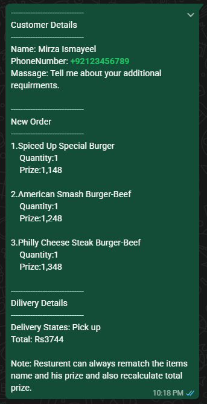
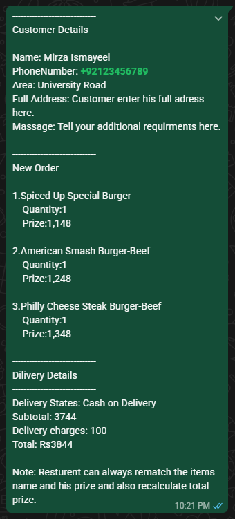

# 🍽️ Spiced Up Restaurant Website

A modern and responsive restaurant website designed to help restaurants build a strong online presence. It enables customers to browse the menu, add items to a shopping cart, and place orders through WhatsApp with a simple and seamless experience. The website is optimized for desktop, tablet, and mobile devices to deliver a consistent user experience across all screen sizes.

## 🌐 Live Demo

**Live Website:**
https://mirzaismayeel.github.io/spiced-up-restaurant/

---

## ✨ Features

1. Fully responsive design
2. 🍽️ Interactive food menu
3. 🏷️ Menu category filtering
4. 🛒 Shopping cart
5. ➕ Increase and decrease item quantity
6. 🗑️ Remove items from the cart
7. 📝 Customer details form
8. 💬 WhatsApp order integration
9. ✨ Smooth UI animations
10. 💾 Cart data saved using Local Storage

---
 
 ## 🎯 Problem Solved

Many restaurant websites suffer from slow performance, poor mobile responsiveness, confusing navigation, and outdated ordering systems. Customers often struggle to browse menus, place orders, and access important information quickly.

This project solves those problems by creating a fast, responsive, and user-friendly restaurant website that provides a smooth browsing and ordering experience across all devices.

---

## 💡 Solution

This website was designed and developed from scratch using only HTML, CSS, and Vanilla JavaScript without any frameworks.

The solution includes:

1. A fully responsive design for desktop, tablet, and mobile devices.
2. Interactive menu filtering for quick food discovery.
3. Shopping cart with real-time quantity and total price updates.
4. Customer information form with WhatsApp order integration.
5. Optimized images and fonts for faster loading.
6. SEO-friendly structure with improved accessibility.
7. Clean UI focused on usability and readability.
8. Modern animations without sacrificing performance.

---

## 🚀 Impact

This solution helps restaurant businesses by:

1. Improving customer browsing experience.
2. Making menu navigation faster and easier.
3. Reducing friction during the ordering process.
4. Increasing mobile usability.
5. Providing a professional online presence.
6. Delivering faster page loading and better Lighthouse scores.
7. Creating a scalable foundation for future online ordering features.

---

## 🏆 Technical Highlights

1. Built with semantic HTML5.
2. Modern CSS using Flexbox and Grid.
3. Vanilla JavaScript (No Frameworks).
4. Local Storage powered shopping cart.
5. Dynamic cart rendering.
6. Responsive design across multiple screen sizes.
7. GitHub Pages deployment ready.
9. Optimized for SEO, Accessibility, and Performance.

---
###  Screenshots

###  Home Page


###  Menu Section


###  Shopping Cart


###  Whatsapp Pick Up Order message



###  Whatsapp Pick Up Order message



###  Mobile View


---

## 🛠️ Technologies Used

* HTML5
* CSS3
* JavaScript (ES6)
* Local Storage

---

## 📂 Project Structure

```text
spiced-up-restaurant/
├── assets/
├── CSS/
├── Data/
├── doc/
│   └── images/
├── javaScript/
├── index.html
├── menu.html
├── style2.css
├── README.md
└── .gitignore
```

---

## 🚀 Getting Started

1. Clone the repository.
2. Open the project folder.
3. Open `index.html` in your browser.

No installation or build tools are required.

---

## 🔮 Future Improvements

* 🔍 Food search functionality
* ❤️ Favorite dishes
* ⭐ Customer reviews
* 🌙 Dark mode
* 💳 Online payment integration
* 🔐 Admin dashboard for menu management

---

## 👨‍💻 Author

**Mirza Ismayeel**

GitHub: https://github.com/MirzaIsmayeel

---

## 📄 License

This project is licensed under the MIT License.
