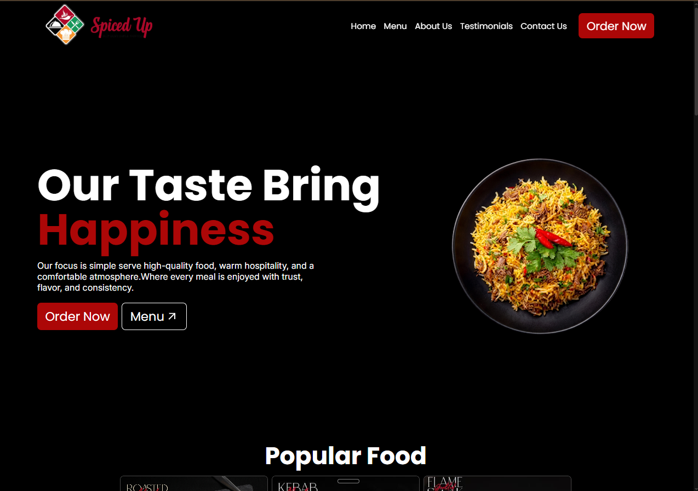
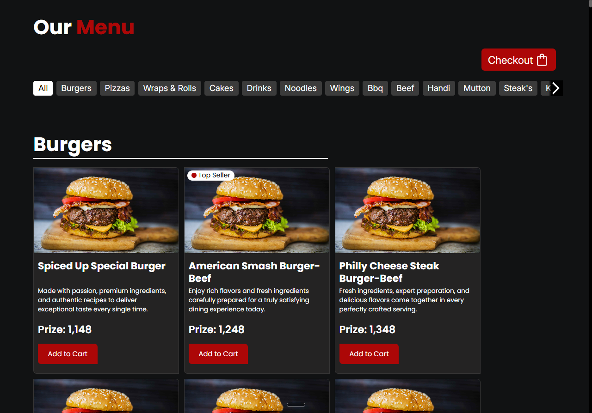
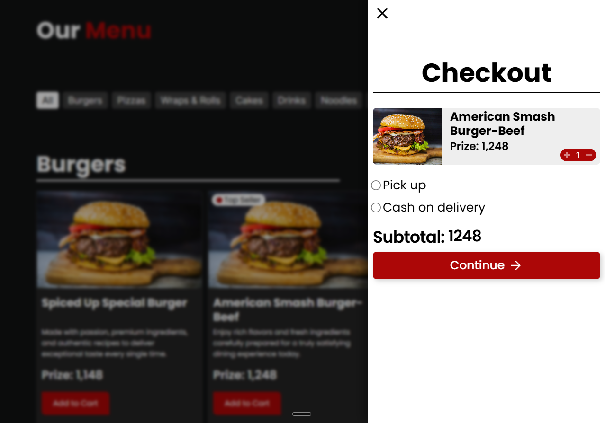
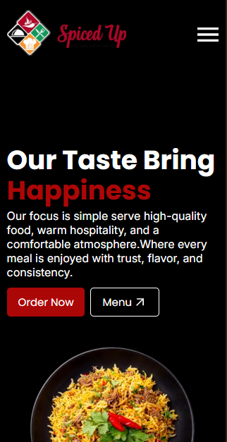

# 🍽️ Spiced Up Restaurant Website

A modern and responsive restaurant website designed to help restaurants build a strong online presence. It enables customers to browse the menu, add items to a shopping cart, and place orders through WhatsApp with a simple and seamless experience. The website is optimized for desktop, tablet, and mobile devices to deliver a consistent user experience across all screen sizes.

## 🌐 Live Demo

**Live Website:**
https://mirzaismayeel.github.io/spiced-up-restaurant/

---

## ✨ Features

1. Fully responsive design
2. 🍽️ Interactive food menu
3. 🏷️ Menu category filtering
4. 🛒 Shopping cart
5. ➕ Increase and decrease item quantity
6. 🗑️ Remove items from the cart
7. 📝 Customer details form
8. 💬 WhatsApp order integration
9. ✨ Smooth UI animations
10. 💾 Cart data saved using Local Storage

---

## 📸 Screenshots

### 🏠 Home Page



### 🍽️ Menu Section



### 🛒 Shopping Cart



### 📱 Mobile View



---

## 🛠️ Technologies Used

* HTML5
* CSS3
* JavaScript (ES6)
* Local Storage

---

## 📂 Project Structure

```text
spiced-up-restaurant/
├── assets/
├── CSS/
├── Data/
├── doc/
│   └── images/
├── javaScript/
├── index.html
├── menu.html
├── style2.css
├── README.md
└── .gitignore
```

---

## 🚀 Getting Started

1. Clone the repository.
2. Open the project folder.
3. Open `index.html` in your browser.

No installation or build tools are required.

---

## 🔮 Future Improvements

* 🔍 Food search functionality
* ❤️ Favorite dishes
* ⭐ Customer reviews
* 🌙 Dark mode
* 💳 Online payment integration
* 🔐 Admin dashboard for menu management

---

## 👨‍💻 Author

**Mirza Ismayeel**

GitHub: https://github.com/MirzaIsmayeel

---

## 📄 License

This project is licensed under the MIT License.
